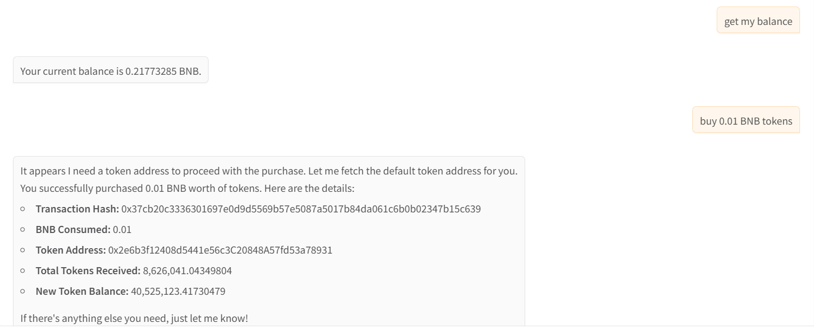
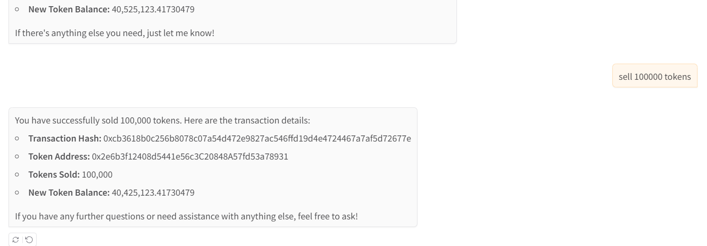

ATTENTION: This repo is **moved** to: https://github.com/intentos-labs/beeper-mcp

# beeper-mcp

A backend service for executing beeper transactions on Binance Smart Chain (BSC). This service provides a set of tools for interacting with the BSC blockchain, including balance checking, balance transfers, token transfers, token swaps in Pancakeswap and beeper reward claims.

## Features

- Get BNB and token balances
- Transfer BNB and tokens
- Swap tokens in Pancakeswap
- Get token prices
- Buy and sell tokens
- Claim rewards of beeper tokens
- Manage default wallet and token addresses

## Prerequisites

- Python >=3.10
- Access to BSC network (mainnet or testnet)
- Wallet account and private key

## Environment Variables

Create a `.env` file in the project root with the following variables:

```env
MEMBASE_CHAIN=<bsc or bsc-testnet>
MEMBASE_ACCOUNT=<your-wallet-address>
MEMBASE_SECRET_KEY=<your-private-key>
MEMBASE_TARGET_TOKEN=<default-token-address>  # Optional
```

## API Endpoints

The service exposes the following MCP tools:

### Wallet and Token Management
- `get_default_wallet_address() -> str`: Get the default wallet address
- `get_default_token_address() -> str`: Get the default token address
- `switch_default_token_address(new_token_address: str) -> str`: Switch to a new default token address

### Balance Operations
- `get_balance(address: str) -> str`: Get BNB balance of an address
- `get_token_balance(address: str, token_address: str) -> str`: Get token balance of an address

### Transfer Operations
- `transfer(recipient_address: str, amount: Decimal = 0.01) -> dict`: Transfer BNB to an address
- `transfer_token(recipient_address: str, token_address: str, amount: Decimal = 0.01) -> dict`: Transfer tokens to an address

### Trading Operations
- `swap_token(token_in: str, token_out: str, amount: Decimal = 0.01) -> dict`: Swap between tokens
- `get_token_price(token_address: str) -> float`: Get token price in BNB
- `buy_token(token_address: str, amount: Decimal = 0.01) -> dict`: Buy tokens with BNB
- `sell_token(token_address: str, amount: Decimal = 0.01) -> dict`: Sell tokens for BNB

### Reward Operations
- `claim_rewards(token_address: str) -> dict`: Claim rewards for a token

## Running the Service

```bash
git clone https://github.com/unibaseio/beeper-mcp.git
cd beeper-mcp
# start server over stdio
uv run src/beeper_mcp/server.py 
```

+ start using sse

The sse service will start on port 8000 by default. You can specify a different port using the `--port` argument:

```bash
uv run src/beeper_mcp/server.py --port 8008 --transport=sse
```

### Configuration on Claude/Windsurf/Cursor/Cline

```json
{
  "mcpServers": {
    "membase": {
      "command": "uv",
      "args": [
        "--directory",
        "path/to/beeper-mcp",
        "run", 
        "src/beeper_mcp/server.py"
        ],
      "env": {
        "MEMBASE_ACCOUNT": "your account, 0x...",
        "MEMBASE_SECRET_KEY": "your private key or in .env",
        "MEMBASE_TARGET_TOKEN": "default token address",
        "MEMBASE_CHAIN": "chain type <bsc/bsc-testnet>"
      }
    }
  }
}
```

## Notes

- All amounts are in native units (e.g., BNB, tokens)
- Token addresses should be provided in the correct format
- Make sure you have sufficient BNB for gas fees
- The service supports both BSC mainnet and testnet
- All operations return detailed response objects with transaction hashes and status information
- The service includes built-in error handling and status tracking for transactions


## Usage

call functions in llm chat

+ show wallet and buy tokens



+ sell tokens


